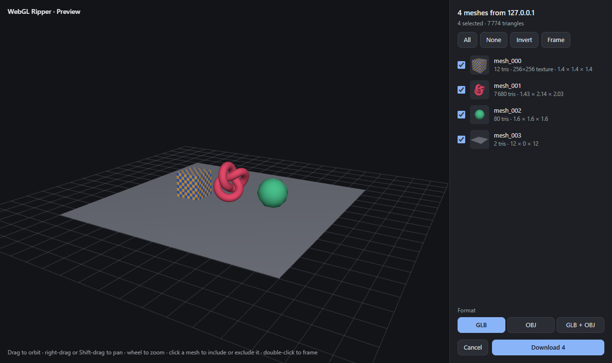
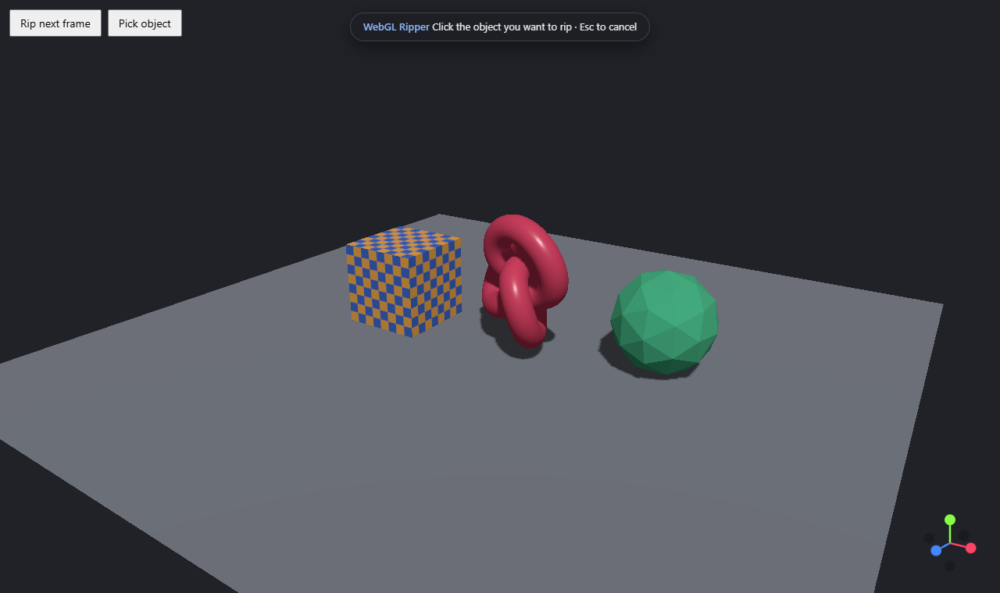
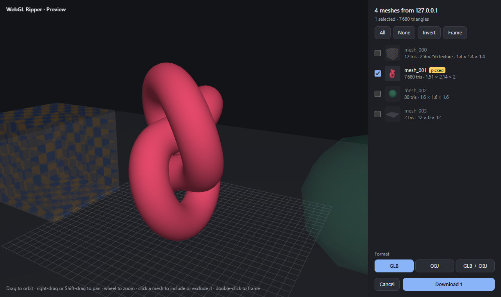
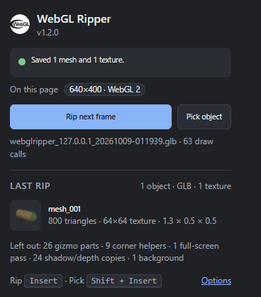
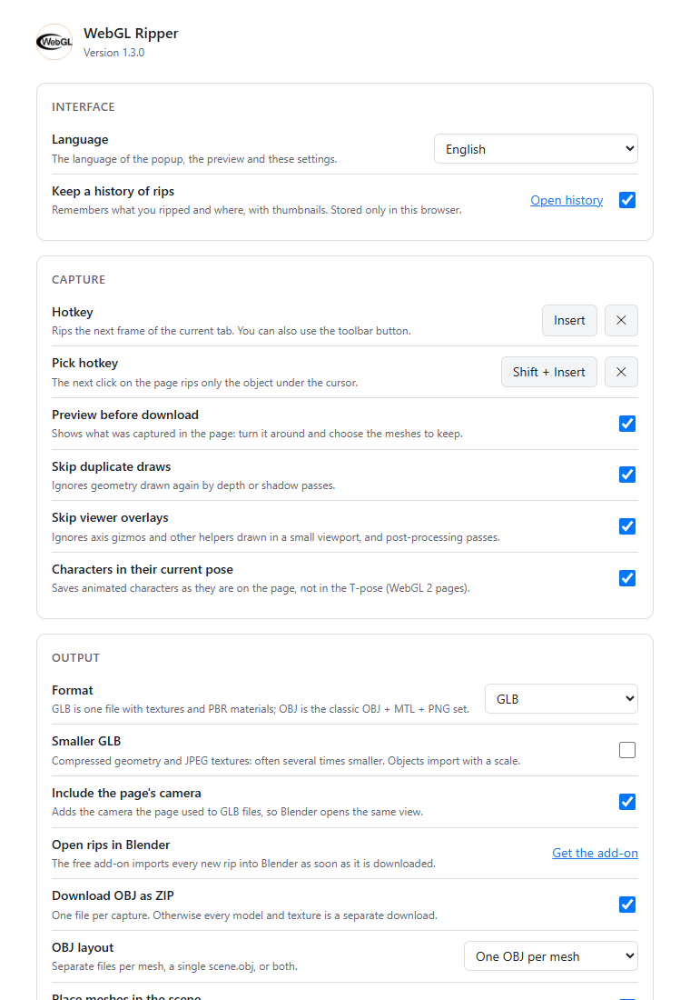

# WebGL Ripper — скачать 3D-модель с сайта

[English](README.md) · **Русский** · [Сайт](https://int3re.github.io/WebGLRipper/ru/) · [Скачать](https://github.com/int3re/WebGLRipper/releases/latest)

[](https://github.com/int3re/WebGLRipper/releases/latest)
[](LICENSE)


Расширение для браузера, которое **извлекает 3D-модели и текстуры со страниц на WebGL** и сохраняет их в **GLB
(glTF 2.0)** или **OBJ + MTL + PNG** — сразу для Blender, Unity, Unreal, Godot и любых других 3D-программ. Оно
записывает один отрисованный кадр, показывает найденное в 3D-превью прямо на странице и скачивает выбранные меши —
с текстурами, цветами материалов, нормалями и положением в сцене.

Работает с three.js, Babylon.js, PlayCanvas, Unity WebGL, Godot, приложениями на Emscripten и обычным кодом на
WebGL 1 / WebGL 2 — в Chrome, Edge, Brave, Opera и Firefox.



## Возможности

- **GLB или OBJ.** Один `.glb` со встроенными текстурами и PBR-материалами (базовый цвет, нормали, свечение,
  затенение, металл/шероховатость, цвета, прозрачность) или ZIP с файлами OBJ, MTL и PNG — или и то и другое.
- **Превью перед скачиванием.** Покрутите сцену, кликами включите или исключите меши, выберите формат.
- **Рип одного объекта кликом.** Нажмите <kbd>Shift</kbd>+<kbd>Insert</kbd> и кликните объект — сохранится только
  он. Работает и сквозь пост-обработку.
- **Готово к импорту.** Модель отцентрована и стоит на «полу», меши на своих местах, недостающие нормали
  рассчитываются (острые грани остаются острыми), вершины, нарисованные по отдельности, снова сварены.
- **Чистый результат.** Проходы теней и глубины, гизмо перемещения и оси в углу, обводки, полноэкранные проходы
  пост-обработки и повторные отрисовки отбрасываются автоматически; «небо» вокруг сцены предлагается невыбранным.
- **Точные текстуры.** Сохраняются байт в байт и в настоящем размере, включая сжатые (DXT/S3TC), float, half-float
  и luminance-текстуры и цвет под прозрачными пикселями.
- **Не нагружает страницу.** Пока вы не нажали горячую клавишу, вызовы отрисовки не перехватываются вовсе; экспорт
  идёт небольшими кусками, так что даже модели с 4K-текстурами не съедают всю память вкладки. Ничего никуда не
  отправляется.

| Режим выбора | Выбранный объект в превью |
| --- | --- |
|  |  |

## Быстрее и лучше оригинала

Это переработанная версия [WebGL Ripper 0.6 от Rilshrink](https://github.com/Rilshrink/WebGLRipper). Обе версии
установлены как расширения в один и тот же Chrome и запущены на одинаковых тестовых страницах
([полное сравнение и методика](docs/comparison.ru.md)):

| Тестовая страница | Оригинал 0.6 | Эта версия |
| --- | --- | --- |
| Сцена three.js с тенями и пост-обработкой | 4 объекта, все в начале координат, без нормалей; текстура 256×256 сохранена как 4096×4096 и назначена всем мешам; страница замирала на 0,4–0,6 с | 4 объекта на своих местах, с нормалями, цветами и правильной текстурой: GLB за **0,17 с**, самый долгий кадр 41 мс |
| 3000 вызовов отрисовки за кадр | за 3 минуты файла нет, страница зависла, **+1,3 ГБ** памяти | **0,28 с** в GLB (+42 МБ), 0,7 с в OBJ ZIP (+78 МБ) |
| Модель на 250 000 вершин с двумя 4K-текстурами | 3,9 с, страница замерла на **1,5 с**, +590 МБ (+226 МБ в GPU), ZIP на **60 МБ**, модель сдвинута со своего места | **1,6 с** в GLB, 2,7 с в OBJ ZIP на **5,6 МБ**; самый долгий кадр меньше 0,2 с, +169–245 МБ |
| Память в стиле Unity / Emscripten | мусор (все вершины в точке 3,4·10³⁸) | точно |
| WebGL создаётся во время загрузки страницы | не перехватывается вовсе | перехватывается |
| Время кадра с 3000 вызовов отрисовки (без захвата) | +0,4–0,5 мс, примерно вдвое медленнее | разницы нет в пределах погрешности (±0,1 мс) |

## Установка

1. Скачайте пакет для своего браузера из [последнего релиза](https://github.com/int3re/WebGLRipper/releases/latest):
   `webglripper-<версия>-chrome.zip` или `webglripper-<версия>-firefox.zip`.
2. **Chrome / Edge / Brave / Opera:** распакуйте, откройте `chrome://extensions/` (`edge://extensions/` в Edge),
   включите **Режим разработчика**, нажмите **Загрузить распакованное расширение** и выберите распакованную папку.
3. **Firefox:** откройте `about:debugging#/runtime/this-firefox`, нажмите **Загрузить временное дополнение…** и
   выберите `-firefox.zip`. Временные дополнения удаляются при перезапуске Firefox.

Уже открытые страницы перезагрузите. Для обновления замените папку новой версией и нажмите ⟳ на карточке
расширения.

> WebGL Ripper не опубликован в Chrome Web Store и других магазинах. Копии оттуда — не из этого проекта и могут
> содержать вредоносный код.

## Как пользоваться

1. Откройте страницу с WebGL и дождитесь, пока модель появится.
2. Нажмите <kbd>Insert</kbd> (или кнопку расширения → **Rip next frame**).
3. Откроется превью. Кликами включите или исключите меши, выберите GLB или OBJ и нажмите **Download** (или
   <kbd>Enter</kbd>; <kbd>Esc</kbd> — отмена).

**Нужен один объект?** Нажмите <kbd>Shift</kbd>+<kbd>Insert</kbd> (или **Pick object** в окне расширения) и
кликните по нему.

Окно расширения показывает, что есть на странице и что сохранил последний рип: каждый объект с миниатюрой,
треугольниками, текстурой и размером, а также что было отброшено (гизмо, помощники, проходы теней, фон).



Значок на кнопке расширения показывает **GL**, когда на странице есть WebGL, **PICK** — пока ждёт вашего клика,
**REC** — пока записывается кадр, **SEL** — пока открыто превью, а затем число сохранённых мешей. Если сцена
перерисовывается только при изменениях, после нажатия клавиши чуть сдвиньте камеру. Нет клавиши <kbd>Insert</kbd>?
Задайте другие в настройках или назначьте сочетания в `chrome://extensions/shortcuts` (Firefox: *Дополнения → ⚙ →
Управление горячими клавишами*).

## Что получается

**GLB** (по умолчанию): `webglripper_<сайт>_<дата>-<время>.glb` — один файл со всеми мешами, их текстурами и
материалами. В Blender: *File → Import → glTF 2.0 (.glb/.gltf)*.

**OBJ:**

```
webglripper_<сайт>_<дата>-<время>.zip
├── mesh_000.obj …        по OBJ на меш (или один scene.obj, см. настройки)
├── materials.mtl         материалы: цвета и текстуры
├── textures/tex_000.png  текстуры, байт в байт
├── model.glb             при формате «GLB + OBJ»
└── rip-info.json         что было захвачено: атрибуты, текстуры и трансформации каждого меша
```

В Blender: *File → Import → Wavefront (.obj)*, выберите все OBJ-файлы (или `scene.obj`).

## Настройки

| Настройка | По умолчанию | |
| --- | --- | --- |
| Hotkey | Insert | Сохраняет текущую вкладку. |
| Pick hotkey | Shift + Insert | Следующий клик по странице сохранит только объект под курсором. |
| Preview before download | вкл. | Показывает захват на странице, чтобы выбрать нужное. |
| Skip duplicate draws | вкл. | Пропускает геометрию, повторно нарисованную проходами глубины и теней. |
| Skip viewer overlays | вкл. | Пропускает оси-гизмо, помощники в маленьком вьюпорте и проходы пост-обработки. |
| Format | GLB | GLB, OBJ или оба. |
| Download OBJ as ZIP | вкл. | Один файл на захват вместо отдельного скачивания каждого файла. |
| OBJ layout | OBJ на меш | Или один `scene.obj`, или оба варианта. |
| Place meshes in the scene | вкл. | Применяет матрицу модели из шейдера. |
| Move to the origin | вкл. | Центрирует модель и ставит её на «пол». |
| Smooth normals when missing | вкл. | Рассчитывает нормали для мешей без них; острые грани остаются острыми. |
| Export vertex colors | вкл. | `v x y z r g b` в OBJ, `COLOR_0` в GLB. |
| Merge duplicate vertices | вкл. | Сваривает треугольники, которые страница нарисовала отдельными вершинами. |
| Unflip textures | вкл. | Согласует UV и изображения для программ, работающих с OBJ. |
| Fallback texture size | 4096 × 4096 | Только если размер текстуры определить не удалось. |
| Advanced | | Дополнительные имена атрибутов, сэмплеров и матриц для незнакомых движков. |
| Debug logging | выкл. | Подробности в консоли разработчика на странице. |



## Как это работает

Коротко: движок запускается внутри страницы раньше её собственных скриптов, оборачивает несколько функций WebGL и по
нажатию клавиши записывает все вызовы отрисовки следующего кадра — геометрию, привязанные текстуры и матрицы из
шейдера. Записанное очищается (проходы теней, гизмо и дубликаты убираются, вершины свариваются, нормали
рассчитываются), показывается в превью и записывается в GLB или OBJ небольшими потоковыми кусками. Режим выбора
после каждого вызова отрисовки читает пиксель под курсором и так находит вызов, нарисовавший кликнутый объект.

Подробно — перехваты, эвристики для матриц и текстур, чтение сжатых и float-текстур, потоковый экспорт, превью, режим
выбора, производительность и приватность — в документе **[Как устроен WebGL Ripper](docs/how-it-works.ru.md)**.

## Вопросы и ответы

**На каких сайтах работает?** На любых страницах, которые рисуют через WebGL в браузере: просмотрщики и
конфигураторы товаров, 3D-галереи, игры на Unity, Godot или PlayCanvas, демо на three.js и Babylon.js. Не работает
там, где картинка рендерится на сервере и приходит видеопотоком, и там, где рисование идёт из Web Worker через
`OffscreenCanvas`.

**Почему персонаж в T-позе или без анимации?** Персонажи, анимированные на видеокарте (скиннинг, morph targets),
сохраняются в исходной позе: вершины двигает вершинный шейдер, а сохраняются исходные данные, загруженные страницей.

**Экспорт пустой или меши не на своих местах.** Включите **Debug logging** и посмотрите в `rip-info.json` имена
атрибутов и uniform-переменных, которые использует страница, затем добавьте их в **Options → Advanced**. Пожалуйста,
создайте issue с адресом сайта и этим файлом.

**Расширение куда-то отправляет мои данные?** Нет. Оно не делает ни одного сетевого запроса, всё происходит в вашем
браузере.

## Ограничения

- Персонажи со скиннингом на GPU сохраняются в исходной позе; morph targets не применяются.
- WebGL внутри Web Worker (`OffscreenCanvas`, переданный в worker) перехватить нельзя.
- Инстансинг: сохраняется одна копия повторяемой геометрии.
- Пачки `WEBGL_multi_draw` не дают трансформаций отдельных объектов, такие меши остаются в локальных координатах.
- Экспорт идёт внутри страницы: очень большим моделям всё же нужна свободная память (около 250 МБ на модель в
  1 млн вершин с четырьмя 4K-текстурами сверх того, что использует сама страница).
- Страницы в изолированных iframe без разрешения на скачивание не могут сохранять файлы — откройте адрес iframe
  в отдельной вкладке.

## Ответственное использование

Модели, текстуры и сцены на сайтах принадлежат их авторам. Сохраняйте только то, что вам разрешено использовать:
свои работы, ресурсы под свободной лицензией или контент, на который у вас есть разрешение, — и соблюдайте условия
сайтов и лицензии.

## Разработка

Сборки не требуется: папка репозитория и есть расширение (`node scripts/build.mjs` собирает пакеты релиза в `dist/`).

- `webglripper.js` — движок захвата, работает в странице (мир `MAIN`) с `document_start`
- `viewer.js` — превью и режим выбора, в странице, изолированы в закрытом shadow root
- `bridge.js` — content script между движком и расширением (настройки, горячие клавиши, прогресс)
- `background.js` — рассылка команд во все фреймы вкладки, значок, горячие клавиши браузера
- `popup.*`, `options.*`, `ui.css`, `settings.js` — интерфейс и общие значения по умолчанию

Тесты запускаются в настоящих браузерах через протоколы автоматизации, нужен только Node.js 22+:

```
node tests/run-chrome.mjs
node tests/run-firefox.mjs
node tests/compare/compare.mjs --original=<папка WebGL Ripper 0.6>
```

Изменения по версиям — в [CHANGELOG.md](CHANGELOG.md).

## Благодарности

Основано на [WebGLRipper](https://github.com/Rilshrink/WebGLRipper) от Rilshrink. Лицензия MIT.

<sub>Ключевые слова: скачать 3D модель с сайта, извлечь 3D модель из браузера, рипер 3D моделей, WebGL ripper,
экспорт модели three.js, Unity WebGL, экспорт в GLB / glTF и OBJ, импорт в Blender, расширение для Chrome,
дополнение для Firefox.</sub>
